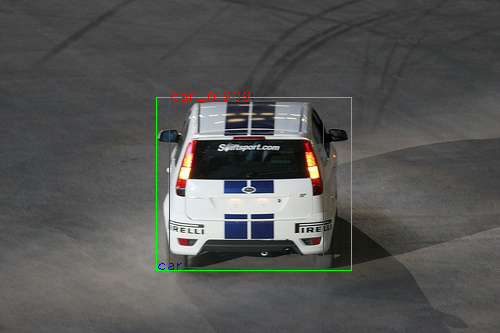
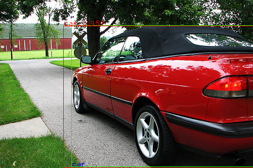

# YOLO_v1

实现`YOLO_v1`目标检测算法

## 实现流程

1. 创建训练数据集
2. 定义`YOLO_v1`模型
3. 定义损失函数`Multi-part Loss`
4. 训练模型
5. 计算`mAP`

## 训练结果

* `mAP`
    * 对于`Location DataSet`, `50`轮训练完成后能够实现`97.31% mAP`
    * 对于`VOC 07`，`50`轮训练完成后能够实现`xxx mAP`
* `FPS`
    * `xxx`

## 相关文档

* [学习 - You Only Look Once: Unified, Real-Time Object Detection](https://blog.zhujian.life/posts/256e06fe.html)