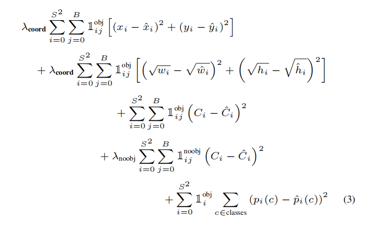

# 损失函数

## 定义

为了有效训练`YOLO`模型，论文提供了一个`Multi-Part Loss`：

* $\lambda_{coord} = 5$
* $\lambda_{noobj} = 0.5$

对于真值边界框而言，其置信度为$1$，对应的类别概率为$\hat{p_{i}}(c) = 1$

## 实现

对于网格内不存在目标，或者不属于`IoU`最大的预测边界框而言，其损失计算仅为

$$
loss = \lambda_{noobj}\sum_{i=0}^{S^{2}}\sum_{j=0}^{B} 1_{ij}^{noobj} (C_{i} - \hat{C_{i}})^{2}
$$

相关实现文件：`py/lib/models/multi_part_loss.py`